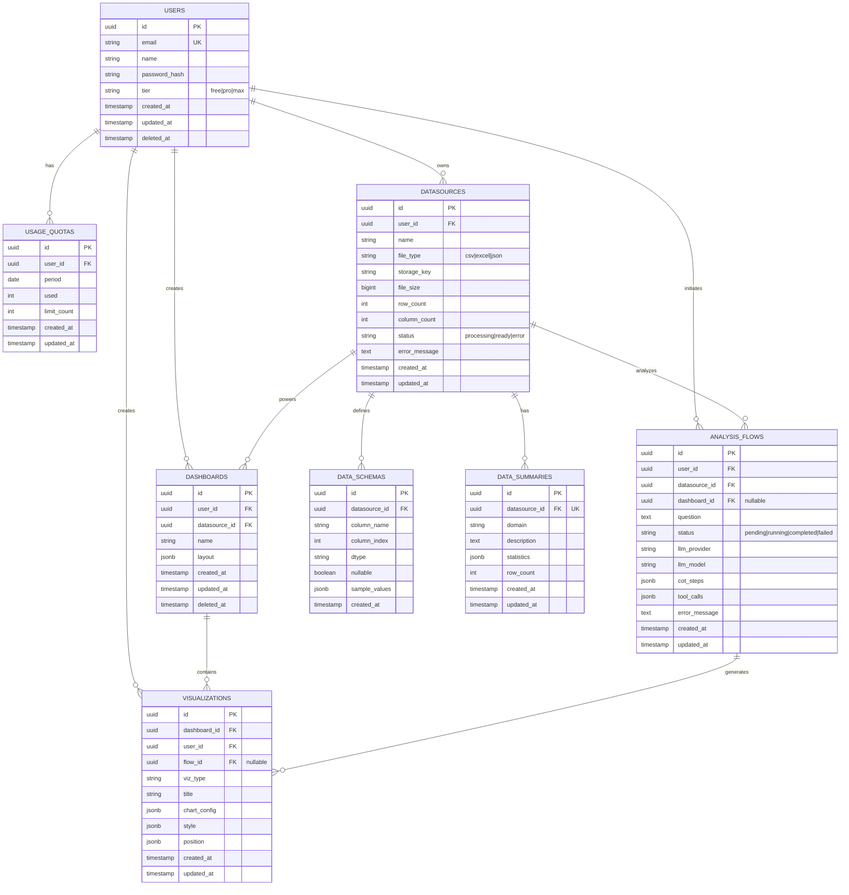

# 데이터베이스 스키마

## 목차
1. 개요 (Overview) .............. L12
2. ER 다이어그램 .............. L25
3. 테이블 정의 .............. L143
4. 인덱스 .............. L304
5. 마이그레이션 이력 .............. L325

---

## 1. 개요 (L16)

DeepMetria 백엔드는 PostgreSQL을 데이터베이스로 사용합니다. 스키마는 8개 테이블로 구성되며, 사용자 인증, 데이터소스 관리, 대시보드/시각화, AI 분석 플로우를 지원합니다.

**주요 특징:**
- UUID 기반 PK (자동 생성)
- 타임스탐프 (created_at, updated_at, deleted_at)
- CASCADE 삭제로 고아 행(orphan rows) 방지
- JSONB로 동적 데이터 저장 (레이아웃, 차트 설정, AI 사고 과정 등)
- CHECK 제약으로 상태값 검증

---

## 2. ER 다이어그램 (L25)



---

## 3. 테이블 정의 (L65)

### 3.1 users

사용자 계정 정보를 저장합니다. 소프트 삭제(deleted_at)를 지원합니다.

| 컬럼 | 타입 | 제약 | 설명 |
|------|------|------|------|
| id | UUID | PK | 자동 생성 |
| email | VARCHAR(255) | NOT NULL, UNIQUE | 로그인 이메일 |
| name | VARCHAR(100) | NOT NULL | 사용자명 |
| password_hash | VARCHAR(255) | NOT NULL | bcrypt 해시 |
| tier | VARCHAR(20) | NOT NULL, DEFAULT 'free' | 요금제: free/pro/max |
| created_at | TIMESTAMP(TZ) | NOT NULL, DEFAULT NOW() | 가입 시간 |
| updated_at | TIMESTAMP(TZ) | NOT NULL, DEFAULT NOW() | 최종 수정 시간 |
| deleted_at | TIMESTAMP(TZ) | NULL | 소프트 삭제 타임스탐프 |

**Check Constraint:** `tier IN ('free', 'pro', 'max')`

---

### 3.2 usage_quotas

사용자별 월간 API 호출 쿼터를 추적합니다.

| 컬럼 | 타입 | 제약 | 설명 |
|------|------|------|------|
| id | UUID | PK | 자동 생성 |
| user_id | UUID | FK(users), NOT NULL | 사용자 참조 |
| period | DATE | NOT NULL | 월별 기간 (YYYY-MM-01 형식) |
| used | INTEGER | NOT NULL, DEFAULT 0 | 현재 사용량 |
| limit_count | INTEGER | NOT NULL, DEFAULT 10 | 월간 한도 |
| created_at | TIMESTAMP(TZ) | NOT NULL, DEFAULT NOW() | 생성 시간 |
| updated_at | TIMESTAMP(TZ) | NOT NULL, DEFAULT NOW() | 수정 시간 |

**Unique Constraint:** `(user_id, period)`

---

### 3.3 datasources

업로드된 데이터 파일 메타데이터를 저장합니다.

| 컬럼 | 타입 | 제약 | 설명 |
|------|------|------|------|
| id | UUID | PK | 자동 생성 |
| user_id | UUID | FK(users), NOT NULL | 소유자 |
| name | VARCHAR(255) | NOT NULL | 파일명 (사용자 설정) |
| file_type | VARCHAR(20) | NOT NULL | csv/excel/json |
| storage_key | VARCHAR(512) | NOT NULL | Cloudflare R2 오브젝트 키 |
| file_size | BIGINT | NOT NULL | 바이트 단위 |
| row_count | INTEGER | NULL | 파일 처리 후 행 수 |
| column_count | INTEGER | NULL | 파일 처리 후 컬럼 수 |
| status | VARCHAR(20) | NOT NULL, DEFAULT 'processing' | processing/ready/error |
| error_message | TEXT | NULL | 처리 오류 메시지 |
| created_at | TIMESTAMP(TZ) | NOT NULL, DEFAULT NOW() | 생성 시간 |
| updated_at | TIMESTAMP(TZ) | NOT NULL, DEFAULT NOW() | 수정 시간 |

**Check Constraints:**
- `file_type IN ('csv', 'excel', 'json')`
- `status IN ('processing', 'ready', 'error')`

---

### 3.4 data_schemas

각 데이터소스의 컬럼 메타데이터를 저장합니다.

| 컬럼 | 타입 | 제약 | 설명 |
|------|------|------|------|
| id | UUID | PK | 자동 생성 |
| datasource_id | UUID | FK(datasources), NOT NULL | 부모 데이터소스 |
| column_name | VARCHAR(255) | NOT NULL | 컬럼명 |
| column_index | INTEGER | NOT NULL | 파일 내 순서 (0-based) |
| dtype | VARCHAR(50) | NOT NULL | string/int/float/datetime/boolean |
| nullable | BOOLEAN | NOT NULL, DEFAULT true | NULL 값 허용 여부 |
| sample_values | JSONB | NULL | 샘플 데이터 (최대 5개) |
| created_at | TIMESTAMP(TZ) | NOT NULL, DEFAULT NOW() | 생성 시간 |

---

### 3.5 data_summaries

각 데이터소스의 통계 요약을 저장합니다. datasource_id마다 최대 1개 행.

| 컬럼 | 타입 | 제약 | 설명 |
|------|------|------|------|
| id | UUID | PK | 자동 생성 |
| datasource_id | UUID | FK(datasources), NOT NULL, UNIQUE | 부모 데이터소스 |
| domain | VARCHAR(255) | NULL | 데이터 도메인 (사용자 입력) |
| description | TEXT | NULL | 데이터 설명 |
| statistics | JSONB | NOT NULL, DEFAULT {} | 통계 (mean, std, min, max 등) |
| row_count | INTEGER | NOT NULL, DEFAULT 0 | 행 수 |
| created_at | TIMESTAMP(TZ) | NOT NULL, DEFAULT NOW() | 생성 시간 |
| updated_at | TIMESTAMP(TZ) | NOT NULL, DEFAULT NOW() | 수정 시간 |

---

### 3.6 dashboards

사용자가 생성한 대시보드를 저장합니다. 소프트 삭제 지원.

| 컬럼 | 타입 | 제약 | 설명 |
|------|------|------|------|
| id | UUID | PK | 자동 생성 |
| user_id | UUID | FK(users), NOT NULL | 소유자 |
| datasource_id | UUID | FK(datasources), NOT NULL | 기반 데이터소스 |
| name | VARCHAR(255) | NOT NULL | 대시보드명 |
| layout | JSONB | NOT NULL, DEFAULT [] | 레이아웃 설정 (시각화 위치) |
| created_at | TIMESTAMP(TZ) | NOT NULL, DEFAULT NOW() | 생성 시간 |
| updated_at | TIMESTAMP(TZ) | NOT NULL, DEFAULT NOW() | 수정 시간 |
| deleted_at | TIMESTAMP(TZ) | NULL | 소프트 삭제 타임스탐프 |

---

### 3.7 visualizations

대시보드에 포함된 개별 차트/시각화를 저장합니다.

| 컬럼 | 타입 | 제약 | 설명 |
|------|------|------|------|
| id | UUID | PK | 자동 생성 |
| dashboard_id | UUID | FK(dashboards), NOT NULL | 부모 대시보드 |
| user_id | UUID | FK(users), NOT NULL | 생성자 |
| flow_id | UUID | NULL | 생성 근거 AnalysisFlow (자동 생성분만) |
| viz_type | VARCHAR(50) | NOT NULL | line/bar/pie/scatter/table/area/histogram/donut/hbar |
| title | VARCHAR(255) | NULL | 차트 제목 |
| chart_config | JSONB | NOT NULL, DEFAULT {} | 차트 설정 (축, 범례, 필터 등) |
| style | JSONB | NOT NULL, DEFAULT {} | 스타일 (색상, 폰트 등) |
| position | JSONB | NOT NULL, DEFAULT {} | 레이아웃 위치 (x, y, width, height) |
| created_at | TIMESTAMP(TZ) | NOT NULL, DEFAULT NOW() | 생성 시간 |
| updated_at | TIMESTAMP(TZ) | NOT NULL, DEFAULT NOW() | 수정 시간 |

**Check Constraint:** `viz_type IN ('line','bar','pie','scatter','table','area','histogram','donut','hbar')`

---

### 3.8 analysis_flows

AI 기반 분석 플로우 (자연어 질문 → 시각화 생성)의 실행 이력을 저장합니다.

| 컬럼 | 타입 | 제약 | 설명 |
|------|------|------|------|
| id | UUID | PK | 자동 생성 |
| user_id | UUID | FK(users), NOT NULL | 요청자 |
| datasource_id | UUID | FK(datasources), NOT NULL | 분석 대상 데이터 |
| dashboard_id | UUID | NULL | 결과 시각화를 추가한 대시보드 |
| question | TEXT | NOT NULL | 사용자 자연어 질문 |
| status | VARCHAR(20) | NOT NULL, DEFAULT 'pending' | pending/running/completed/failed |
| llm_provider | VARCHAR(50) | NULL | 사용된 LLM 제공업체 (anthropic, openai 등) |
| llm_model | VARCHAR(100) | NULL | 사용된 모델명 (claude-3-5-sonnet 등) |
| cot_steps | JSONB | NOT NULL, DEFAULT [] | 사고의 사슬(Chain-of-Thought) 단계 |
| tool_calls | JSONB | NOT NULL, DEFAULT [] | 호출된 도구/함수 이력 |
| error_message | TEXT | NULL | 실패 시 오류 메시지 |
| created_at | TIMESTAMP(TZ) | NOT NULL, DEFAULT NOW() | 생성 시간 |
| updated_at | TIMESTAMP(TZ) | NOT NULL, DEFAULT NOW() | 수정 시간 |

**Check Constraint:** `status IN ('pending', 'running', 'completed', 'failed')`

---

## 4. 인덱스 (L190)

쿼리 성능 최적화를 위한 인덱스 목록:

| 테이블 | 인덱스명 | 컬럼 | 조건 | 목적 |
|--------|---------|------|------|------|
| users | idx_users_email | email | deleted_at IS NULL | 로그인 조회 (소프트 삭제 제외) |
| usage_quotas | idx_usage_quotas_user_period | (user_id, period) | — | 월간 쿼터 조회 |
| datasources | idx_datasources_user_id | user_id | — | 사용자 파일 목록 |
| datasources | idx_datasources_status | status | — | 처리 상태별 조회 |
| data_schemas | idx_data_schemas_datasource | datasource_id | — | 스키마 조회 |
| dashboards | idx_dashboards_user_id | user_id | deleted_at IS NULL | 사용자 대시보드 목록 |
| dashboards | idx_dashboards_datasource | datasource_id | — | 데이터소스 기반 대시보드 |
| visualizations | idx_visualizations_dashboard | dashboard_id | — | 대시보드 내 시각화 조회 |
| visualizations | idx_visualizations_user | user_id | — | 사용자 시각화 조회 |
| analysis_flows | idx_analysis_flows_user | user_id | — | 사용자 분석 이력 |
| analysis_flows | idx_analysis_flows_datasource | datasource_id | — | 데이터소스 분석 이력 |
| analysis_flows | idx_analysis_flows_status | status | — | 진행 중인 작업 조회 |

---

## 5. 마이그레이션 이력 (L210)

| 버전 | 파일 | 설명 | 생성일 |
|------|------|------|--------|
| 0001 | `alembic/versions/0001_initial_schema.py` | 초기 스키마 생성 (8개 테이블) | 2026-04-20 |

**마이그레이션 실행:**
```bash
cd backend
alembic upgrade head
```

**현재 스키마 상태 확인:**
```bash
alembic current
```
