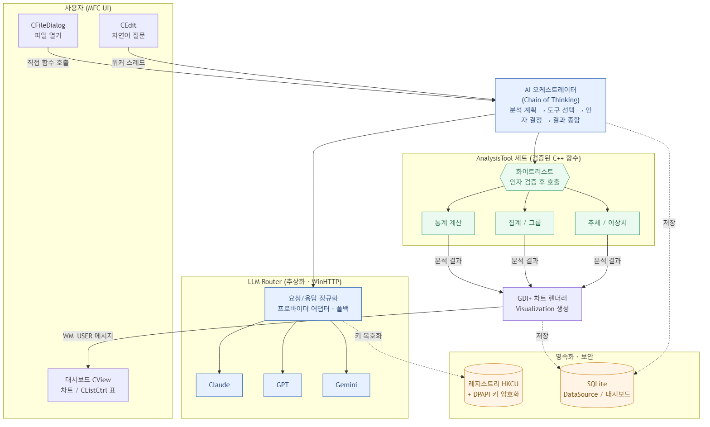
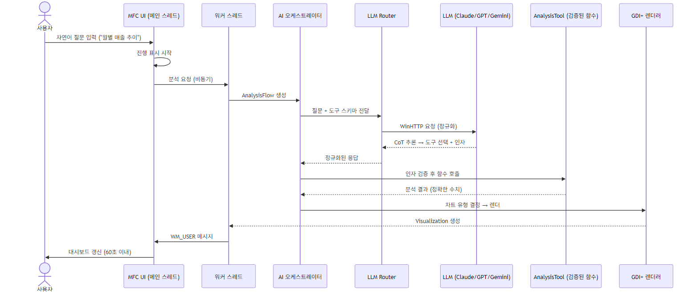

# DeepMetria 설계 다이어그램

`docs/핵심설계.md`의 아키텍처를 Mermaid로 작성하고 PNG/SVG로 렌더링한 결과물.

## 1. 전체 아키텍처 (AI 오케스트레이터 모델)



- 소스: [`architecture.mmd`](./architecture.mmd) · 이미지: `architecture.png` / `architecture.svg`

## 2. 자연어 질문 → 시각화 흐름 (FR-03~05, NFR-01)



- 소스: [`flow-question.mmd`](./flow-question.mmd) · 이미지: `flow-question.png` / `flow-question.svg`

---

## 재생성 방법

Mermaid CLI(`mmdc`)가 필요하다. (설치: `npm i -g @mermaid-js/mermaid-cli`)

```bash
cd docs/diagrams
mmdc -i architecture.mmd  -o architecture.png  -b transparent -s 2
mmdc -i architecture.mmd  -o architecture.svg
mmdc -i flow-question.mmd -o flow-question.png -b white -s 2
mmdc -i flow-question.mmd -o flow-question.svg
```

- `-s 2`: 2배 해상도(발표 슬라이드용) · `-b`: 배경색 · `.svg`: 무손실 확대용
- `.mmd`만 수정하고 위 명령으로 이미지를 다시 만든다.
