# DeepMetria 상세설계서

> **프로젝트명**: DeepMetria — LLM 기반 데이터 분석 MFC 데스크톱 애플리케이션  
> **작성일**: 2026-05-12  
> **버전**: v1.0 (초안)

---

## 목차

1. [시스템 구조 설계](#1-시스템-구조-설계)
   - 1.1 시스템 구조도
   - 1.2 시스템 개요
2. [프로그램 설계](#2-프로그램-설계)
   - 2.1 전체 프로세스
   - 2.2 데이터 파일 불러오기, AI 요약, 저장 기능 프로세스
   - 2.3 자연어 분석, 시각화, 서식 편집 기능 프로세스
3. [사용자 인터페이스 설계](#3-사용자-인터페이스-설계) → Part 2
   - 3.1 데이터 파일 불러오기 기능
   - 3.2 AI 데이터 요약 기능
   - 3.3 자연어 분석 질문 기능
   - 3.4 시각화 서식 편집 기능
   - 3.5 차트 내보내기 기능

---

## 1. 시스템 구조 설계

### 1.1 시스템 구조도

#### 1.1.1 전체 시스템 아키텍처

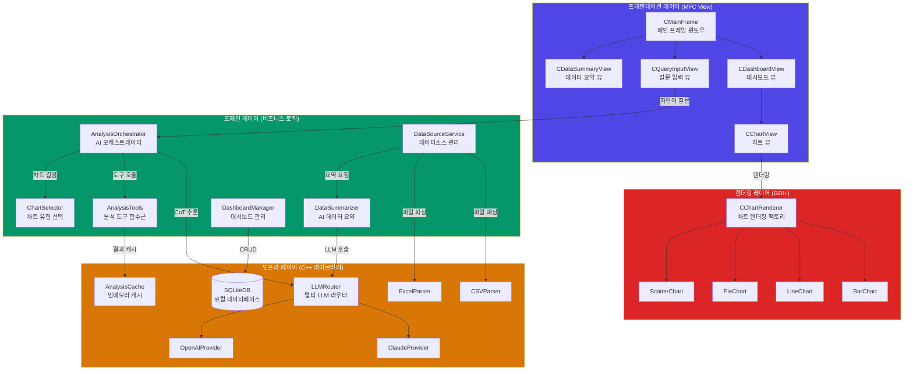

#### 1.1.2 MFC Document/View 구조

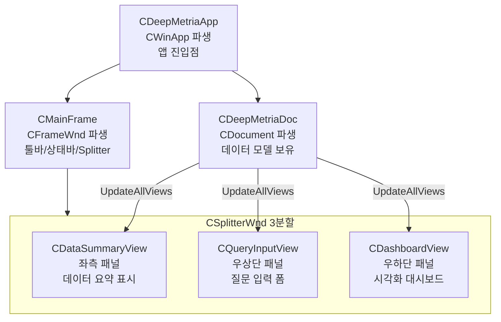

#### 1.1.3 클래스 다이어그램

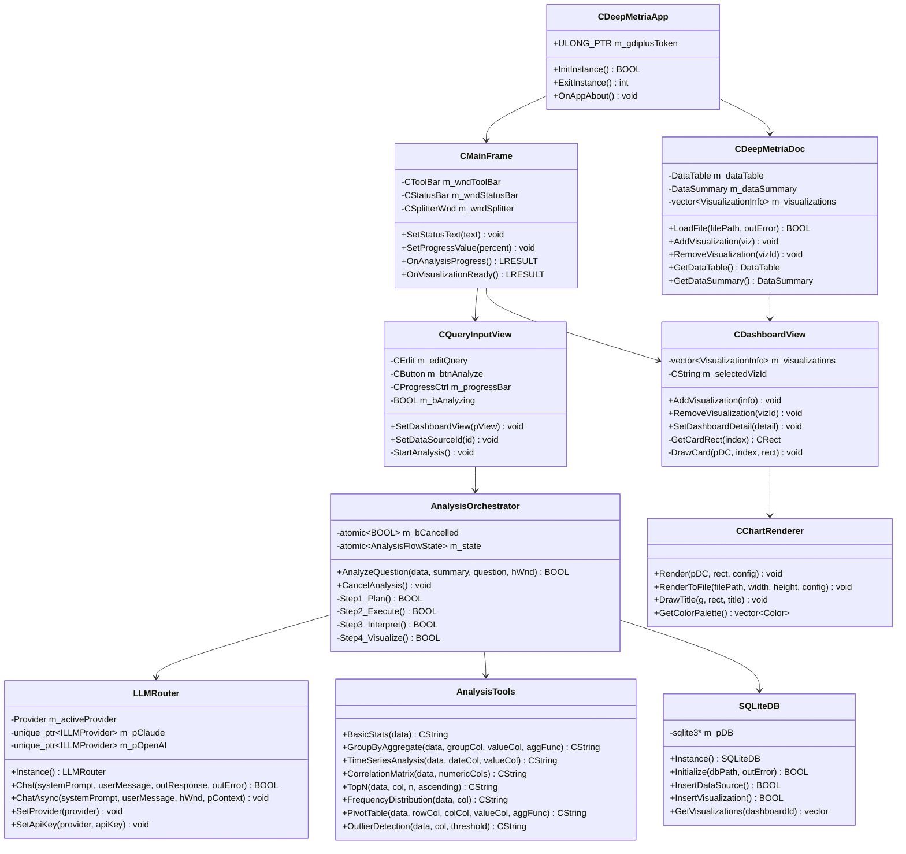

#### 1.1.4 데이터베이스 ER 다이어그램

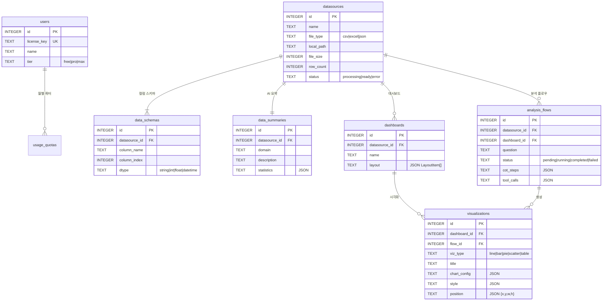

### 1.2 시스템 개요

#### 1.2.1 시스템 목적

DeepMetria는 **비개발자 비즈니스 사용자**를 대상으로 하는 LLM 기반 데이터 분석 Windows 데스크톱 애플리케이션이다. 사용자가 데이터 파일(CSV/Excel/JSON)을 불러오면 AI가 자동으로 데이터를 요약하고, 자연어 질문에 따라 적절한 분석 도구와 차트를 선택하여 대시보드에 시각화를 생성한다.

#### 1.2.2 핵심 기술 스택

| 계층 | 기술 | 용도 |
|------|------|------|
| UI | MFC (CFrameWnd/CView/CSplitterWnd) | 윈도우 UI 프레임워크 |
| 렌더링 | GDI+ | 차트 렌더링 |
| LLM | WinHTTP (Claude API / OpenAI API) | AI 추론 |
| DB | SQLite 3 | 로컬 데이터 저장 |
| 캐시 | std::unordered_map | 분석 결과 캐시 |
| 빌드 | MSBuild (Visual Studio) | 컴파일/링크 |

#### 1.2.3 운영 환경

- **OS**: Windows 10 이상
- **배포**: MSI 인스톨러 (단일 프로세스 실행)
- **네트워크**: LLM API 호출 시에만 인터넷 필요
- **로컬 저장**: `%APPDATA%\DeepMetria\` 하위 SQLite DB 및 파일

---

## 2. 프로그램 설계

### 2.1 전체 프로세스

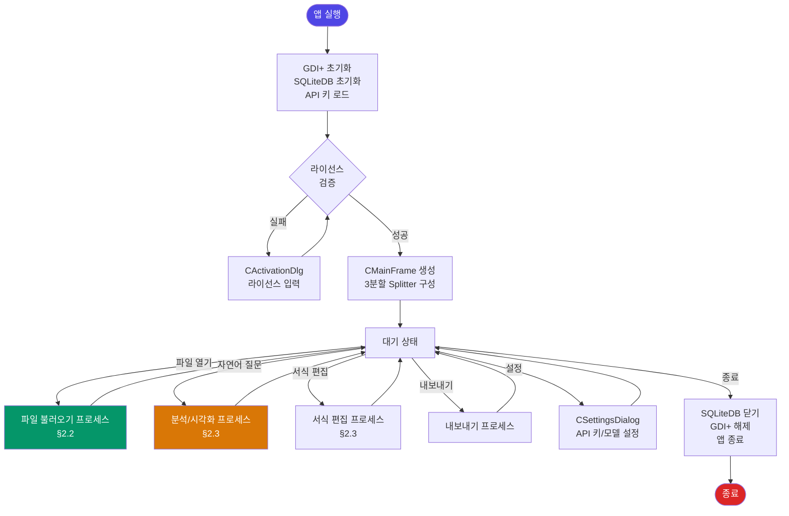

### 2.2 데이터 파일 불러오기, AI 요약, 저장 기능 프로세스

#### 2.2.1 파일 불러오기 → AI 자동 요약 플로우

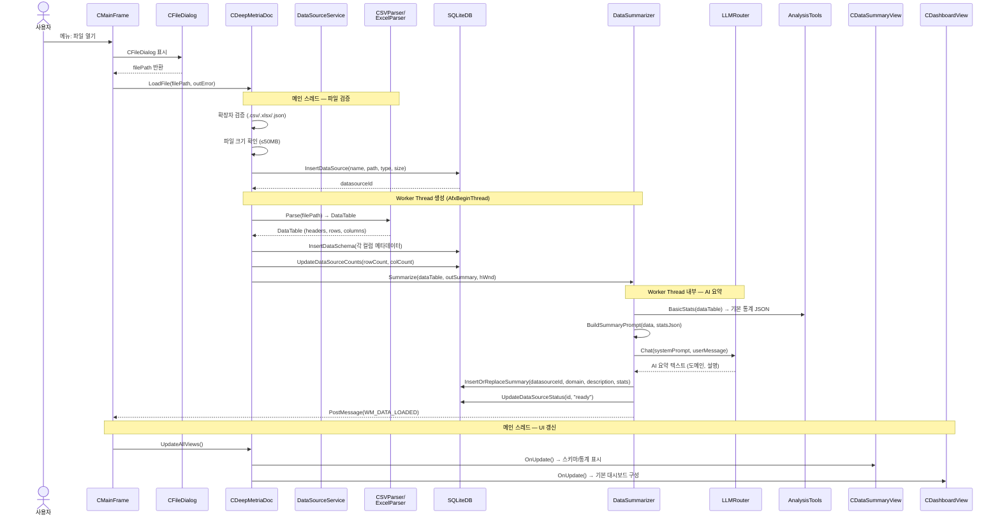

#### 2.2.2 파일 파싱 상세 흐름

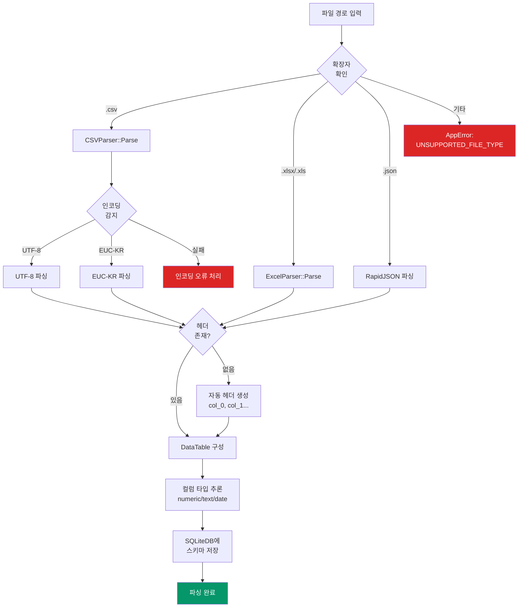

### 2.3 자연어 분석, 시각화, 서식 편집 기능 프로세스

#### 2.3.1 자연어 질문 → AI 분석 → 시각화 생성 플로우

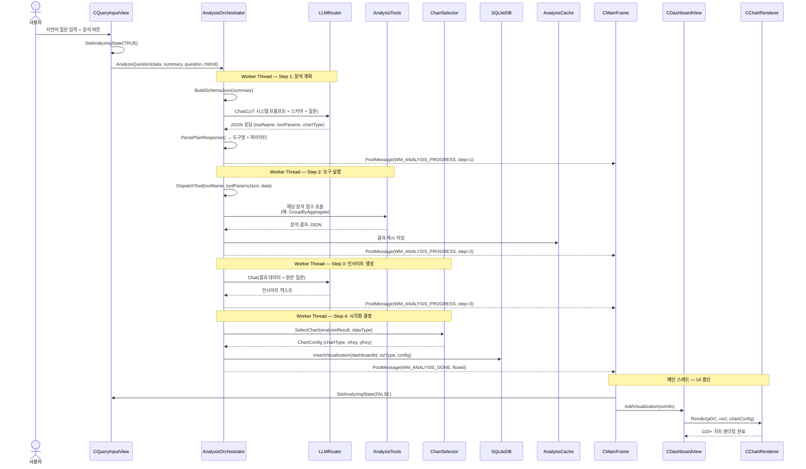

#### 2.3.2 CoT(Chain-of-Thought) 4단계 분석 흐름

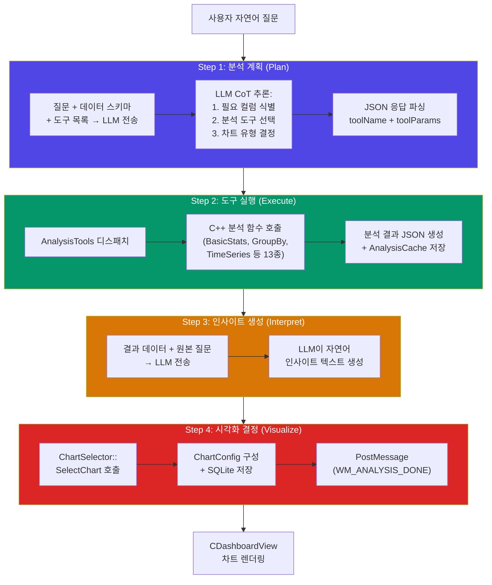

#### 2.3.3 시각화 서식 편집 프로세스

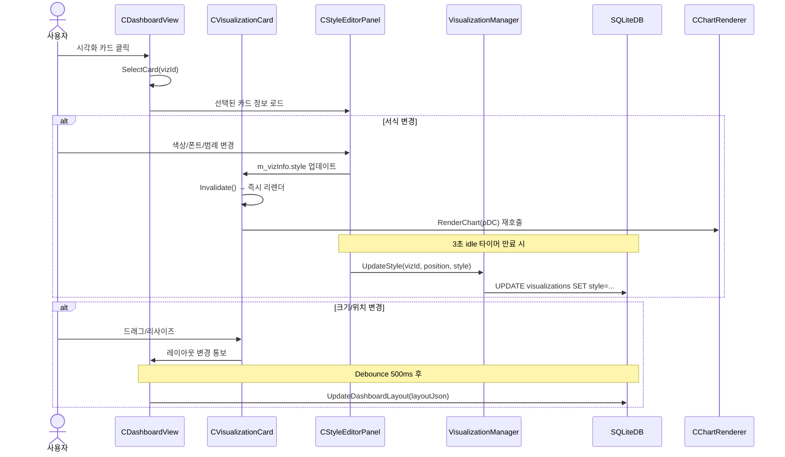

#### 2.3.4 차트 내보내기 프로세스

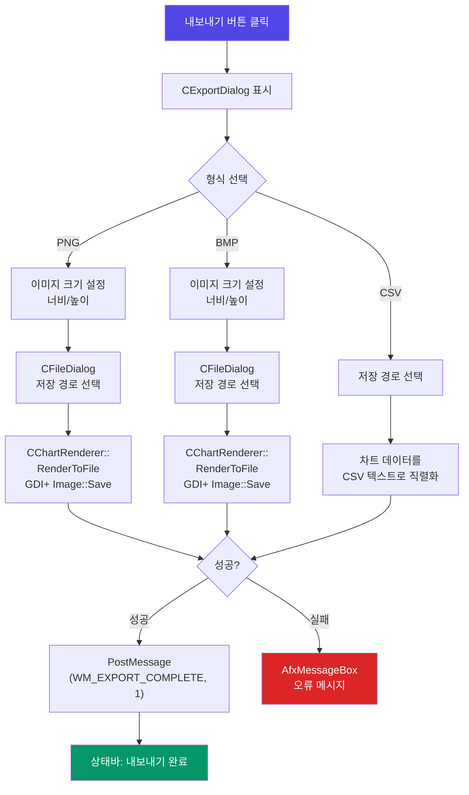

---

> **Part 2 (사용자 인터페이스 설계)는 `상세설계서_part2.md`에서 계속됩니다.**
