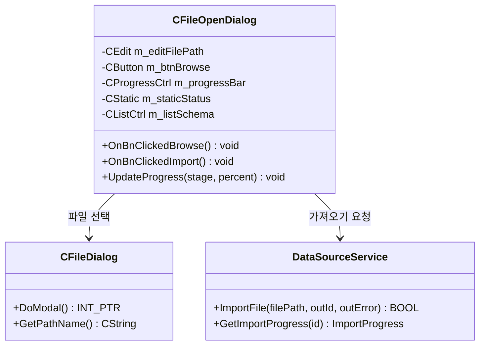
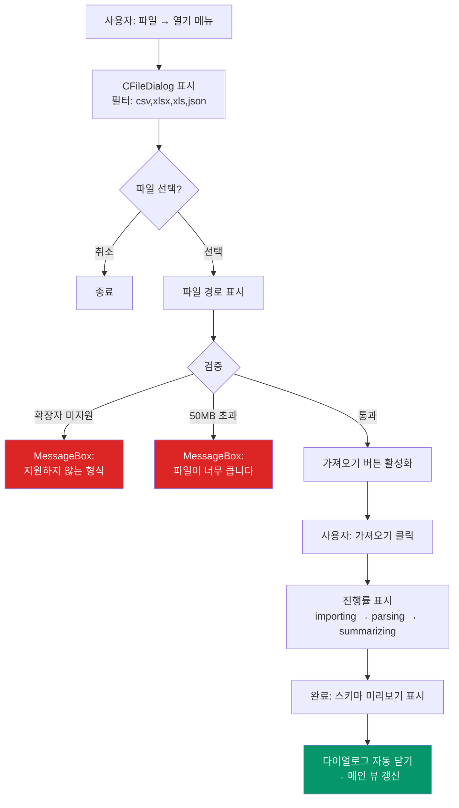
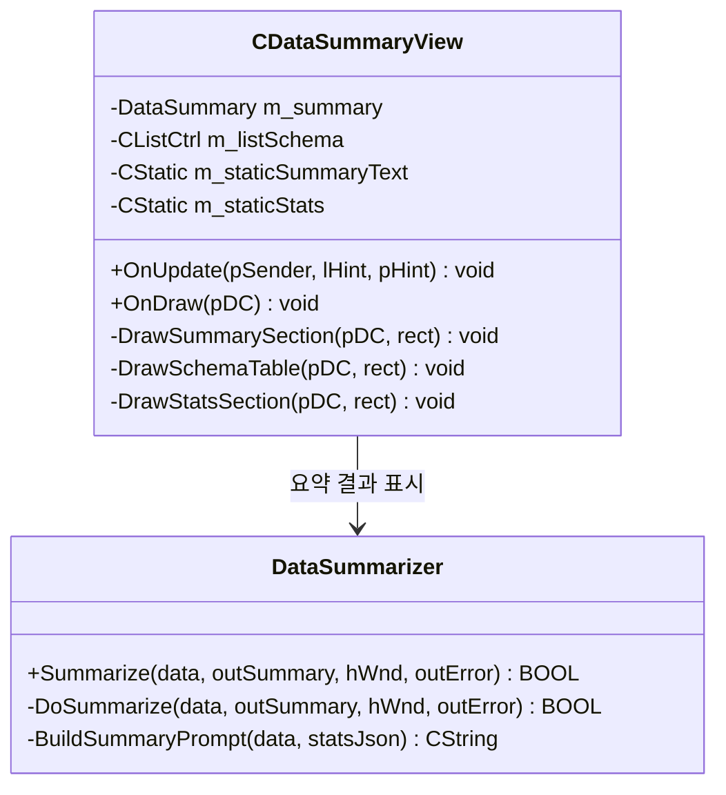
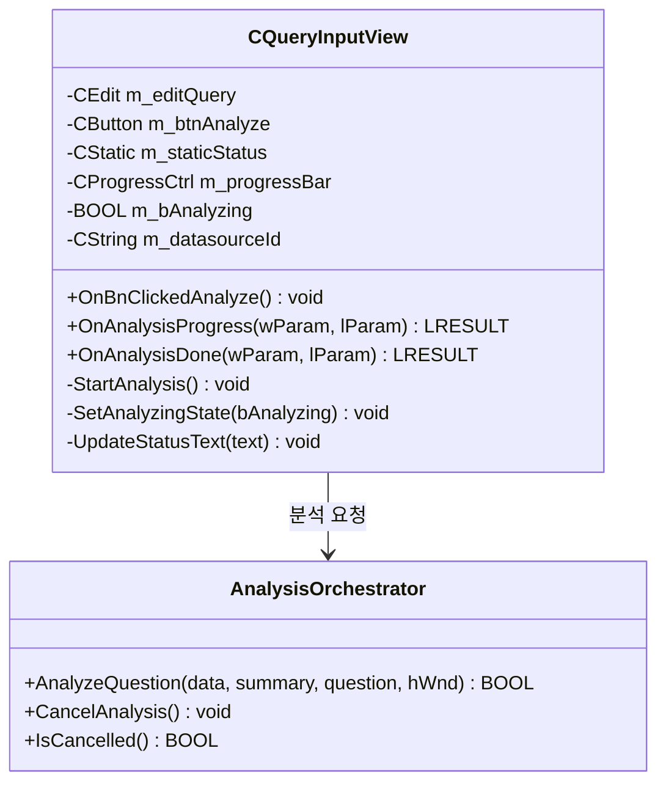
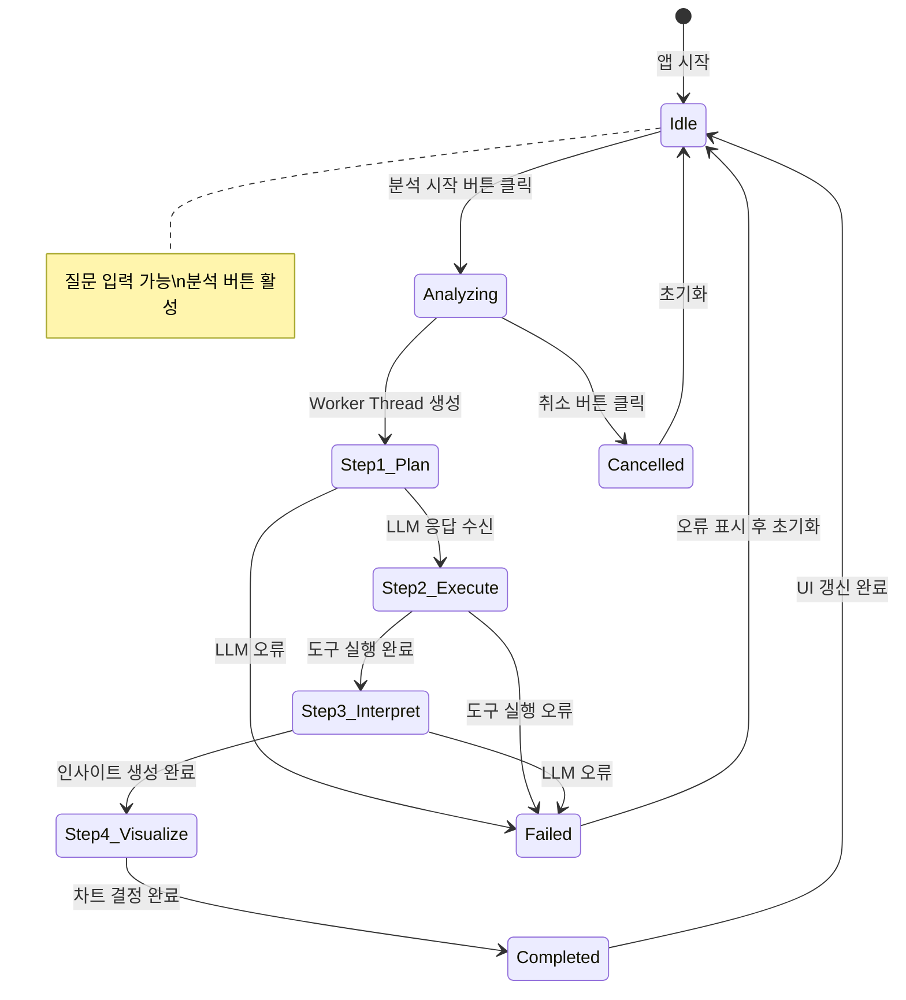
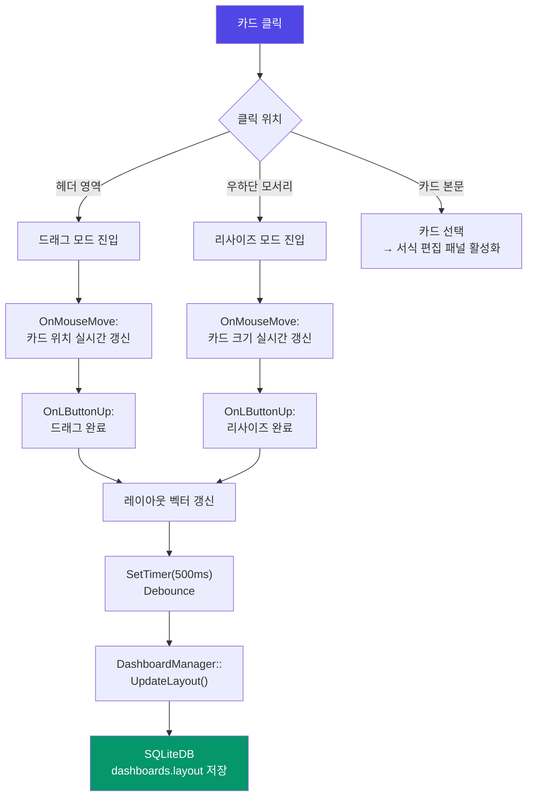
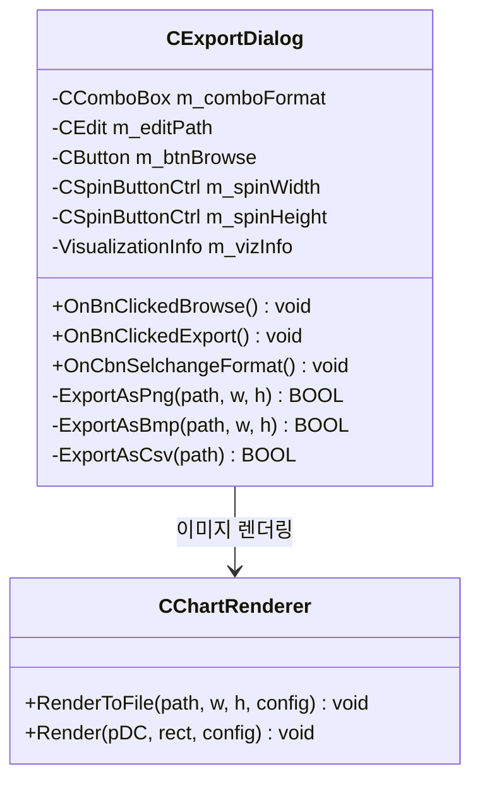
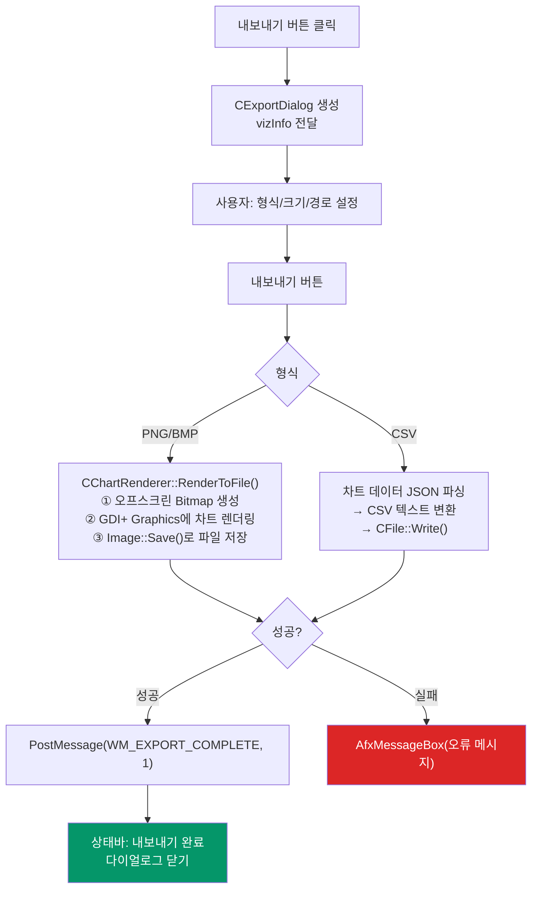

# DeepMetria 상세설계서 — Part 2: 사용자 인터페이스 설계

> **Part 1 (시스템 구조 설계, 프로그램 설계)은 `상세설계서_part1.md` 참조**

---

## 3. 사용자 인터페이스 설계

### 3.1 데이터 파일 불러오기 기능

#### 3.1.1 화면 구성

```
┌─────────────────────────────────────────────────┐
│  DeepMetria — 데이터 파일 불러오기               │
├─────────────────────────────────────────────────┤
│                                                 │
│  파일 경로: [____________________________] [찾기]│
│                                                 │
│  지원 형식: CSV (.csv) | Excel (.xlsx/.xls)     │
│             | JSON (.json)                      │
│  최대 크기: 50MB                                │
│                                                 │
│  ┌─────────────────────────────────────────┐    │
│  │  가져오기 진행 상태                       │    │
│  │  ████████████████░░░░░░░░  65%          │    │
│  │  현재 단계: 파싱 중...                    │    │
│  └─────────────────────────────────────────┘    │
│                                                 │
│  ┌─ 스키마 미리보기 ──────────────────────┐     │
│  │ #  컬럼명      타입     샘플값          │     │
│  │ 1  order_date  date     2024-01-15     │     │
│  │ 2  product     text     노트북          │     │
│  │ 3  revenue     numeric  1500000        │     │
│  └────────────────────────────────────────┘     │
│                                                 │
│              [가져오기]    [취소]                 │
└─────────────────────────────────────────────────┘
```

#### 3.1.2 관련 클래스 및 컨트롤



#### 3.1.3 처리 흐름



#### 3.1.4 WM 메시지 흐름

| 메시지 | 발신 | 수신 | 용도 |
|--------|------|------|------|
| `WM_IMPORT_PROGRESS` | Worker Thread | CFileOpenDialog | 진행률 갱신 (0~100) |
| `WM_IMPORT_COMPLETE` | Worker Thread | CMainFrame | 가져오기 완료 통보 |
| `WM_DATA_LOADED` | DataSummarizer | CMainFrame | AI 요약 완료 → 뷰 갱신 |

---

### 3.2 AI 데이터 요약 기능

#### 3.2.1 화면 구성 (CDataSummaryView — 좌측 패널)

```
┌─ 데이터 요약 ─────────────────┐
│                               │
│  📁 sales_2024.csv            │
│  ─────────────────────────    │
│  행 수: 15,230                │
│  컬럼 수: 8                   │
│                               │
│  📊 도메인: 영업/매출 데이터    │
│                               │
│  ┌─ AI 요약 ──────────────┐   │
│  │ 이 데이터는 2024년도     │   │
│  │ 월별 제품 매출 기록으로,  │   │
│  │ 총 15,230건의 거래가     │   │
│  │ 포함되어 있습니다.       │   │
│  └────────────────────────┘   │
│                               │
│  ┌─ 컬럼 스키마 ──────────┐   │
│  │ order_date  date       │   │
│  │ product     text       │   │
│  │ revenue     numeric    │   │
│  │ quantity    numeric    │   │
│  │ region      text       │   │
│  └────────────────────────┘   │
│                               │
│  ┌─ 기본 통계 ────────────┐   │
│  │ revenue                │   │
│  │  평균: 523,400         │   │
│  │  중앙값: 480,000       │   │
│  │  표준편차: 215,300     │   │
│  │  결측치: 12건          │   │
│  └────────────────────────┘   │
└───────────────────────────────┘
```

#### 3.2.2 관련 클래스



#### 3.2.3 AI 요약 생성 흐름


---

### 3.3 자연어 분석 질문 기능

#### 3.3.1 화면 구성 (CQueryInputView — 우상단 패널)

```
┌─ 자연어 분석 ──────────────────────────────────┐
│                                                │
│  ┌──────────────────────────────────────┐      │
│  │ 월별 매출 추이를 보여주세요            │      │
│  │                                      │      │
│  └──────────────────────────────────────┘      │
│                                [🔍 분석 시작]   │
│                                                │
│  ─── 분석 진행 상태 ───                         │
│  ████████████████████████░░░░  75%              │
│  현재 단계: Step 3 — 인사이트 생성 중...        │
│                                                │
│  ┌─ CoT 추론 과정 ────────────────────────┐    │
│  │ ✅ Step 1: 컬럼 식별                   │    │
│  │    → date: order_date, value: revenue  │    │
│  │ ✅ Step 2: 도구 선택                   │    │
│  │    → TimeSeriesAnalysis 실행 완료      │    │
│  │ ⏳ Step 3: 인사이트 생성               │    │
│  │    → LLM 응답 대기 중...               │    │
│  │ ⬜ Step 4: 시각화 결정                 │    │
│  └────────────────────────────────────────┘    │
└────────────────────────────────────────────────┘
```

#### 3.3.2 관련 클래스 및 메시지



#### 3.3.3 상태 전이 다이어그램



---

### 3.4 시각화 서식 편집 기능

#### 3.4.1 화면 구성 (CDashboardView — 우하단 + CStyleEditorPanel)

```
┌─ 대시보드 ────────────────────────────────────────────┬── 서식 편집 ──┐
│                                                       │              │
│  ┌─ 월별 매출 추이 ──────────┐ ┌─ 제품별 매출 비교 ─┐  │ 제목:        │
│  │     ╱╲                    │ │  ██                │  │ [월별 매출]  │
│  │    ╱  ╲   ╱╲             │ │  ██ ██             │  │              │
│  │   ╱    ╲ ╱  ╲            │ │  ██ ██ ██          │  │ 색상 스킴:   │
│  │  ╱      ╳    ╲           │ │  ██ ██ ██ ██       │  │ [default ▾]  │
│  │ ╱      ╱ ╲    ╲          │ │                    │  │              │
│  │1월 2월 3월 4월 5월        │ │ A  B  C  D        │  │ 폰트 크기:   │
│  │ [선택됨 — 파란 테두리]     │ │                    │  │ [14 ▲▼]     │
│  └───────────────────────────┘ └────────────────────┘  │              │
│                                                       │ 범례: [✓]    │
│  ┌─ 지역별 매출 분포 ────────┐                         │ 그리드: [✓]  │
│  │      ╭───╮               │                         │              │
│  │     ╱     ╲              │                         │ 크기:        │
│  │    │ 35%   │             │                         │ W: [6 ▲▼]   │
│  │    │       │  25%        │                         │ H: [4 ▲▼]   │
│  │     ╲  40%╱              │                         │              │
│  │      ╰───╯               │                         │ [적용] [초기화]│
│  └───────────────────────────┘                         │              │
└────────────────────────────────────────────────────────┴──────────────┘
```

#### 3.4.2 서식 편집 속성

| 속성 | 타입 | 기본값 | MFC 컨트롤 |
|------|------|--------|-----------|
| 제목 (title) | CString | AI 생성 제목 | CEdit |
| 색상 스킴 (colorScheme) | enum | default | CComboBox |
| 폰트 크기 (fontSize) | int | 14pt | CSpinButtonCtrl |
| 범례 표시 (showLegend) | BOOL | TRUE | CButton (체크박스) |
| 그리드 표시 (showGrid) | BOOL | TRUE | CButton (체크박스) |
| 너비 (w) | int | 6 (그리드 단위) | CSpinButtonCtrl |
| 높이 (h) | int | 4 (그리드 단위) | CSpinButtonCtrl |

#### 3.4.3 색상 스킴 팔레트

| 스킴 | 색상 1 | 색상 2 | 색상 3 | 색상 4 | 색상 5 |
|------|--------|--------|--------|--------|--------|
| default | `#6366F1` | `#22D3EE` | `#F97316` | `#A3E635` | `#F43F5E` |
| blue | `#3B82F6` | `#60A5FA` | `#93C5FD` | `#BFDBFE` | `#DBEAFE` |
| green | `#22C55E` | `#4ADE80` | `#86EFAC` | `#BBF7D0` | `#DCFCE7` |
| warm | `#F97316` | `#FB923C` | `#FBBF24` | `#FDE047` | `#FEF08A` |
| mono | `#1E293B` | `#475569` | `#94A3B8` | `#CBD5E1` | `#E2E8F0` |

#### 3.4.4 드래그/리사이즈 동작



---

### 3.5 차트 내보내기 기능

#### 3.5.1 화면 구성 (CExportDialog)

```
┌─────────────────────────────────────────┐
│  차트 내보내기                           │
├─────────────────────────────────────────┤
│                                         │
│  대상: 월별 매출 추이 (Line Chart)       │
│                                         │
│  형식: [PNG ▾]                          │
│                                         │
│  ┌─ 이미지 크기 ──────────────────┐     │
│  │  너비: [1200 ▲▼] px            │     │
│  │  높이: [ 800 ▲▼] px            │     │
│  └────────────────────────────────┘     │
│                                         │
│  저장 경로: [________________________]   │
│                              [폴더 선택] │
│                                         │
│           [내보내기]    [취소]            │
└─────────────────────────────────────────┘
```

#### 3.5.2 관련 클래스



#### 3.5.3 지원 형식 및 처리

| 형식 | 확장자 | 처리 방식 | 크기 설정 |
|------|--------|----------|----------|
| PNG | .png | GDI+ `Image::Save(ImageFormatPNG)` | 사용자 지정 (기본 1200×800) |
| BMP | .bmp | GDI+ `Image::Save(ImageFormatBMP)` | 사용자 지정 (기본 1200×800) |
| CSV | .csv | 차트 데이터를 텍스트 직렬화 | N/A |

#### 3.5.4 내보내기 처리 흐름



---

## 부록: 주요 데이터 구조 요약

### A. 핵심 구조체 (Common/Types.h)

| 구조체 | 주요 멤버 | 용도 |
|--------|---------|------|
| `AppError` | code, message, severity | 공통 오류 반환 |
| `DataTable` | columns, headers, rows, rowCount | 파싱된 데이터 |
| `DataSummary` | schema, rowCount, aiSummaryText | AI 요약 정보 |
| `VisualizationInfo` | vizType, chartConfig, style, position | 시각화 카드 정보 |
| `ChartConfig` | chartType, title, xLabel, yLabel, dataJson | 차트 설정 |
| `ChartStyle` | primaryColor, fontSize, showLegend, showGrid | 차트 스타일 |
| `LayoutItem` | x, y, w, h | 그리드 위치/크기 |
| `CotStep` | stepType, content, index | CoT 추론 단계 |
| `AnalysisFlowInfo` | flowStatus, cotSteps, bStreaming | 분석 상태 |

### B. WM 커스텀 메시지 목록

| 메시지 | 코드 | WPARAM | 용도 |
|--------|------|--------|------|
| `WM_ANALYSIS_PROGRESS` | WM_USER+100 | 진행률 0~100 | 분석 단계 진행 |
| `WM_ANALYSIS_DONE` | WM_USER+101 | flowId | 분석 완료 |
| `WM_VISUALIZATION_READY` | WM_USER+102 | vizId | 시각화 준비 완료 |
| `WM_DATA_LOADED` | WM_USER+103 | 0 | 데이터 로드/요약 완료 |
| `WM_LLM_RESPONSE` | WM_USER+104 | 0 | LLM 비동기 응답 |
| `WM_EXPORT_COMPLETE` | WM_USER+105 | 성공(1)/실패(0) | 내보내기 완료 |
| `WM_COT_STEP` | WM_USER+106 | 0 | CoT 단계 통보 |
| `WM_IMPORT_PROGRESS` | WM_USER+108 | 진행률 0~100 | 가져오기 진행 |
| `WM_IMPORT_COMPLETE` | WM_USER+110 | datasourceId | 가져오기 완료 |

---

> **끝 — DeepMetria 상세설계서 (Part 1 + Part 2)**
